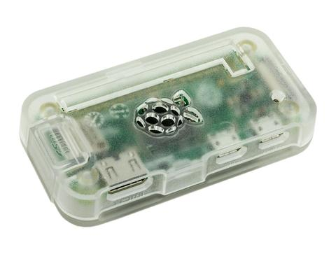
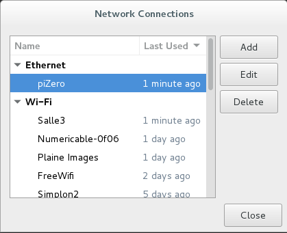
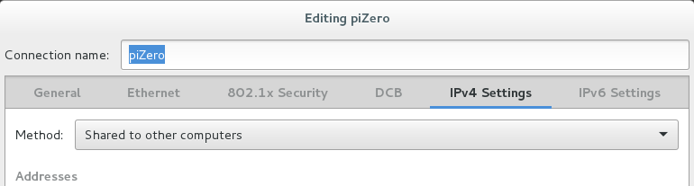
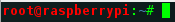
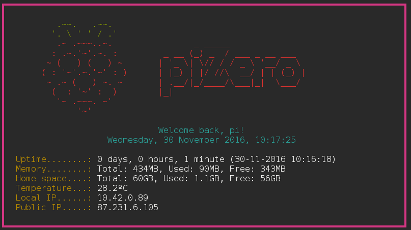

# Installation piZero accessoire

## Installation Raspbian Jessie Lite et config USB/Ethernet gadget

1. Formatez la carte SD (16GO minimum)
2. Télécharger l'image de Raspbian Lite, la décompresser et l'installer sur la carte avec la commande suivante:

`~$ sudo pv Downloads/raspbian-jessie-lite.img  | dd of=/dev/mmcblk0 bs=1M`

`~$ sudo sync`
3. Insérer la carte SD dans le pi Zero et le brancher à un écran et à un clavier
4. Changer le layout du clavier et authoriser le login en tant que pi au démarrage avec:

`~$ sudo raspi-config`
5. Eteindre le pi Zero et remettre la carte SD dans le PC
6. Ajouter la ligne suivante la fin du fichier /boot/config.txt de la carte

`dtoverlay=dwc2`
7. Dans le fichier /boot/cmdline.txt ajouter `modules-load=dwc2,g_ether` après `rootwait`.

!!! ATTENTION A LA SYNTAXE ET AUX ESPACES DANS CE FICHIER
8. Démonter proprement la carte du PC et booter le pi.
On peut maintenant y accéder via la commande:

`~$ ssh pi@raspberrypi.local`

## Partager Internet via USB

Sur DEBIAN:
1. Une fois le piZero reconnu et connecté au PC, taper la commande suivante:

`~$ nm-connection-editor`

2. Editer la connection ethernet aller dans ipv4 settings et choisir "share with other computers"

3. (facultatif)Installer et configurer PHP sur nginx
	1. Installer PHP:

	`~$ sudo apt-get install php5-fpm`

	2. Configurer nginx:
        
	* Supprimer le fichier de configuration actuel:

	`sudo rm /etc/nginx/sites-available/default`

	* Remplacer le default par le fichier du repo.
	
	`sudo nano /etc/nginx/sites-available/default`

## Installer un émulateur de terminal accessible via navigateur
1. Installer les paquets avec la commande:

`sudo apt-get install openssl shellinaboxi nginx`

Vous pouvez maintenant accéder au terminal du raspberry a l'adresse ip_raspberry:4200 

2. Créer le dossier .shellinabox

`mkdir .shellinabox`

3. Placer custom.css et favicon.ico a l'intérieur de .shellinabox

Ajouter la ligne suivante à /etc/default/shellinabox:

`SHELLINABOX_ARGS="-f favicon.ico:/home/pi/.shellinabox/favicon.ico -f styles.css:/home/pi/.shellinabox/custom.css"`

4. Vous pouvez maintenant personnaliser le CSS et le favicon de shellinabox dans .shellinabox. Faites attention au nommage des fichiers: custom.css & favicon.ico

## Configurer l'utilisateur ROOT

1. Créer un mot de passe

`~$ sudo passwd root`

2. Prompt rouge pour l'utilisateur ROOT. Ajouter les lignes suivantes dans le .bashrc de ROOT:

`# Red Prompt for ROOT user`
`PS1='${debian_chroot:+($debian_chroot)}\[\033[01;31m\]\u@\h\[\033[00m\]:\[\033[01;34m\]\w\[\033[00m\]\$`

## Installer des trucs utiles

`sudo apt-get update && sudo apt-get install curl vim tree tmux htop iptraf git-core w3m`

## PimpMyZero

`
1. MOTD sympa:

Copier le motd.sh du repo dans /etc/profile.d puis taper les commandes suivantes:

`$ sudo chown root:root motd.sh
$ sudo chmod +x motd.sh`

3. Supprimer l'ancien motd avec:

`$ sudo rm /etc/motd`

## Sources
[http://blog.gbaman.info/?p=699](http://blog.gbaman.info/?p=699)

[http://raspbian-france.fr/installer-nginx-raspbian-raspberry/](http://raspbian-france.fr/installer-nginx-raspbian-raspberry/)

[http://n-o-d-e.net/post/138478383831/how-to-add-a-low-profile-wifi-board-to-a-raspberry](http://n-o-d-e.net/post/138478383831/how-to-add-a-low-profile-wifi-board-to-a-raspberry)

### TODO:
* Installer carte wifi sur le pi
* Changer hostname

